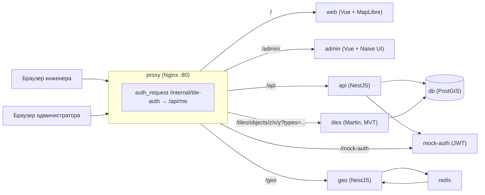
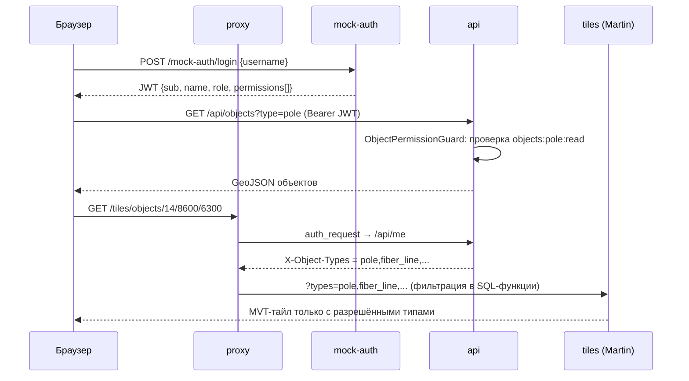
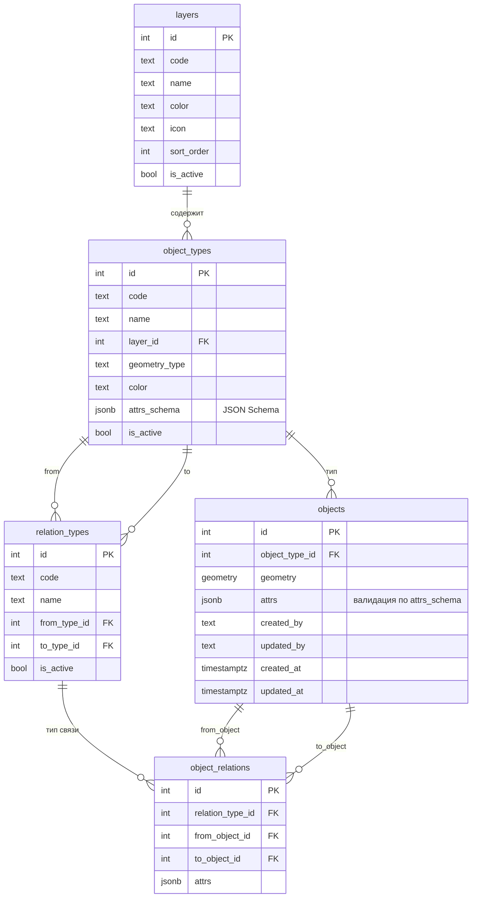
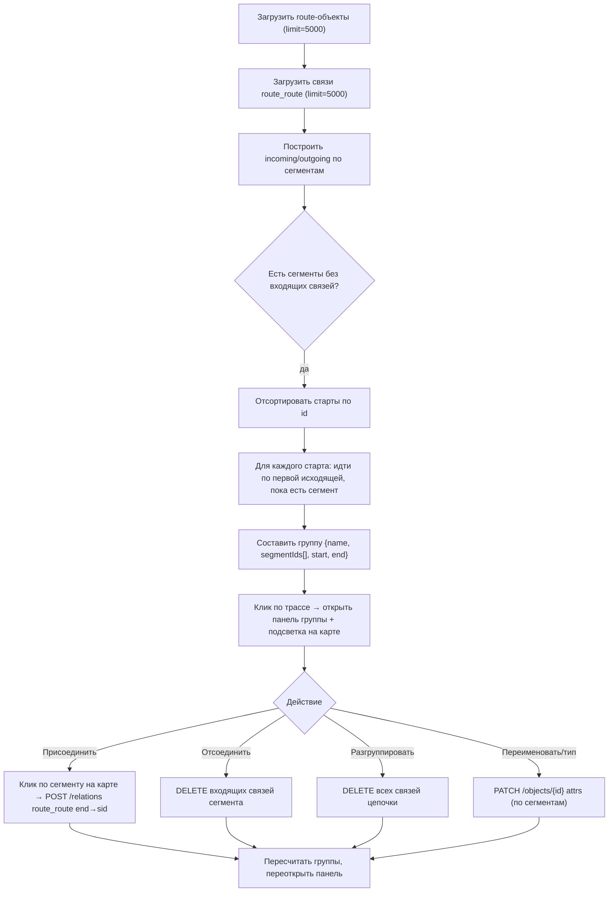

# DMAP — геоинформационный сервис провайдера

Единый обзорный документ: возможности, архитектура, схемы (Mermaid) и краткое руководство пользователя.
Статус: актуально на 2026-08-31.

---

## 1. Назначение

**DMAP** — GIS-сервис для интернет-провайдера. Сетевой инженер отмечает на карте инфраструктуру: столбы, линии оптики, муфты, трассы, дома абонентов и активное оборудование; связывает объекты между собой; администратор ведёт справочники (слои, типы объектов, типы связей) без изменения кода. Всё разворачивается в Docker.

---

## 2. Возможности сервиса

### 2.1 Карта и слои
- Карта на **MapLibre GL** с OSM-растром (dev) и векторными тайлами (MVT, Martin) объектов.
- Слои строятся из справочника `layers → object_types`; переключатель видимости слоёв по правам пользователя.
- Сворачиваемая панель-легенда со списком слоёв и вкладками «Объекты» / «Связи».

### 2.2 Объекты на карте
- Просмотр объектов по слоям, поиск по названию/атрибутам/ID (`GET /objects?search=`).
- Создание, перемещение, правка геометрии и удаление объектов (рисование через **maplibre-gl-geoman**).
- Динамические формы атрибутов по `attrs_schema` типа: text / number / integer / enum / checkbox / date / textarea.
- Список объектов в текущем viewport (кнопка «≡» → «Таблица объектов», обзорный список с переходом на карту).
- Модалка «История» с журналом изменений объекта.

### 2.3 Связи объектов
- CRUD связей между объектами (например «линия → столб»): создание через форму (тип → источник → назначение), отрисовка линий на карте, клик → свойства/удаление.
- Типы связей из справочника `relation_types`; видимость и правка — по правам `object-relations:<code>:read|write`.

### 2.4 Трассы (группировка сегментов) — выделенная функция
Трасса — это цепочка самостоятельных объектов типа `route`, соединённых связями `route_route` (`from = предыдущий сегмент → to = следующий`).
- **Клиентский резолвер:** старт цепочки = сегмент без входящей `route_route`-связи, конец — без исходящей; цепочка собирается по первой исходящей связи.
- Клик по трассе на карте открывает панель группы: название, начало/конец, число сегментов.
- Действия: **переименовать** трассу (обновляет `name` всех сегментов), **изменить тип прокладки** (`laying_type: underground/aerial`) по сегментам, **присоединить сегмент** (режим выбора на карте → создание связи `route_route`), **отсоединить** сегмент, **разгруппировать** (удаление всех связей цепочки).
- Подсветка активной группы на карте (оранжевая линия, зелёная точка старта, красная — конца).
- Список вьюпорта группирует сегменты под заголовком «Трасса: название».
- Read-only пользователь (viewer) видит состав и метаданные трассы, но без кнопок редактирования.

### 2.5 Администрирование (приложение admin)
- CRUD справочников: **слои**, **типы объектов** (с атрибут-схемой `attrs_schema`), **типы связей**.
- Структурный редактор JSON Schema (AttrsSchemaEditor) + режим сырого JSON.
- Страница **«Трассы»**: все цепочки (имя, начало/конец, число сегментов), раскрытие состава, переименование, присоединение сегмента (выбор из списка), отвязка, разгруппировка.

### 2.6 Безопасность и аудит
- **RBAC:** динамические права из JWT-claims (`objects:<code>:read|write`, `object-relations:<code>:read|write`, `object-types:manage`). Новый тип объекта = новые права без изменения кода.
- Тайлы фильтруются по правам через nginx `auth_request` → `/api/me` (ADR-002); без JWT — 401.
- **Аудит:** журнал `change_log` (создание/изменение/перемещение/удаление объектов и связей, actor, diff) + эндпоинты истории и модалка в web.

### 2.7 Геокодирование (Dadata)
- `GET /geo/suggest?query=…` — автоподсказки адреса в форме дома.
- `GET /geo/reverse?lat=&lon=` — «Определить адрес по точке» на карте.
- `GET /geo/forward?address=…`, `GET /geo/company?query=…`.
- Кэш ответов в Redis (TTL 7 дней), провайдер `mock | dadata` без изменения фронта.

### 2.8 UX и адаптивность
- FAB «+» для быстрого создания объектов, поиск по объектам, нижняя панель на мобильных (bottom-sheet), модалки на весь экран, тач-таргеты ≥ 44 px.

---

## 3. Архитектура

### 3.1 Принципы
1. Все сервисы — контейнеры Docker, оркестрация через Docker Compose (целевая среда — кластер k3s `summersite`).
2. API доверяет claims JWT и не содержит собственной аутентификации.
3. **Справочно-ориентированная модель (ADR-001):** типы объектов и связей — данные, а не код.
4. Единая точка входа — Nginx (`proxy`), маршрутизация по путям.

### 3.2 Состав сервисов

| Сервис | Стек | Роль |
|--------|------|------|
| `proxy` | Nginx | единый вход, маршрутизация `/api`, `/tiles`, `/mock-auth`, `/geo`, `/admin/`, `/`; `auth_request` для тайлов |
| `web` | Vue 3 + Vite + MapLibre GL | SPA инженера (карта, объекты, связи, трассы) |
| `admin` | Vue 3 + Vite + TypeScript + Naive UI | SPA администратора (справочники, трассы) |
| `api` | Node.js + NestJS | REST, RBAC, валидация attrs (ajv), связи, аудит |
| `tiles` | Martin (MVT) | векторные тайлы объектов из PostGIS |
| `db` | PostgreSQL + PostGIS | хранение, пространственные запросы, MVT-функция `tiles_objects` |
| `geo` | NestJS | геокодирование (Dadata), кэш в Redis |
| `redis` | Redis 7 | кэш ответов geo |
| `mock-auth` | Node.js + Express | заглушка аутентификации, выдаёт JWT |

### 3.3 Схема сервисов (Mermaid)



### 3.4 Поток аутентификации и прав (Mermaid)



### 3.5 Модель данных (Mermaid)



Отдельно: журнал аудита `change_log` (без FK на объекты — история сохраняется после удаления).

### 3.6 Алгоритм резолвера трасс (Mermaid)



### 3.7 Маршруты через proxy

| Путь | Назначение |
|------|-----------|
| `/api/*` | REST API |
| `/tiles/objects/{z}/{x}/{y}` | MVT-тайлы (JWT-фильтр) |
| `/mock-auth/*` | логин / список пользователей |
| `/geo/*` | геокодирование |
| `/admin/` | SPA администратора |
| `/` | SPA инженера |

---

## 4. Краткое руководство пользователя

### 4.1 Вход
1. Откройте приложение: web-карта — `http://localhost/`, админка — `http://localhost/admin/`.
2. Выберите пользователя и войдите. Тестовые учётные записи (mock-auth):

| Пользователь | Роль | Возможности |
|--------------|------|-------------|
| `admin` | Администратор | всё + управление справочниками |
| `engineer` | Инженер | чтение и запись по всем объектам и связям |
| `viewer` | Наблюдатель | только просмотр |

> Права определяются не ролью, а списком `permissions` в JWT.

### 4.2 Карта (web)
- **Переключение слоёв** — панель слева (легенда): чекбоксы видимости слоёв и типов связей.
- **Поиск объекта** — поле «Поиск…» (по названию/атрибутам/ID), переход к найденному.
- **Список объектов в обзоре** — кнопка «≡» → «Таблица объектов»; двойной клик по строке — переход на карту.
- **Быстрое создание** — кнопка FAB «+» → выбрать тип → рисовать на карте.

### 4.3 Объекты
- **Клик по объекту** — панель свойств (атрибуты, создал/изменил, «История»).
- **Редактирование** (нужно право `write`): изменить атрибуты и «Сохранить», «Удалить», «Изменить геометрию» (перемещение/правка формы).
- **Создание связи** — панель «Связи» → «Новая связь» → тип → источник → назначение.

### 4.4 Трассы (группы сегментов)
1. **Клик по трассе на карте** — откроется панель группы (название, начало/конец, число сегментов, список сегментов с типом прокладки).
2. **Переименовать** — поле «Название трассы» → «Сохранить» (обновится у всех сегментов).
3. **Изменить тип прокладки** — выпадающий список `underground`/`aerial` у сегмента → «Сохранить».
4. **Присоединить сегмент** — «Присоединить сегмент» → кликните следующий сегмент на карте (появится подсказка внизу панели). Присоединить можно сегмент без предыдущего.
5. **Отсоединить / Разгруппировать** — кнопка «Отсоединить» у сегмента / «Разгруппировать» у трассы (с подтверждением).

> Наблюдатель (viewer) видит состав трассы, но кнопки редактирования скрыты.

### 4.5 Админка (admin)
- **Слои** — «Слои»: список, создание/изменение слоёв.
- **Типы объектов** — «Типы объектов»: код, имя, слой, геометрия, атрибут-схема (`attrs_schema`) через структурный редактор или сырой JSON.
- **Типы связей** — «Типы связей»: код, имя, типы «из» и «в».
- **Трассы** — «Трассы»: список всех цепочек; клик по карточке раскрывает состав; «Присоединить сегмент» (выбор из списка сегментов без предыдущего), «Отвязать», «Разгруппировать», «Сохранить название».

### 4.6 Полезные команды

```bash
docker compose up -d --build     # собрать и поднять всё
docker compose ps                # статус контейнеров
docker compose logs -f api       # логи API
curl http://localhost/api/health # проверка API
# войти как engineer (вернёт JWT):
curl -X POST http://localhost/mock-auth/login \
  -H 'Content-Type: application/json' -d '{"username":"engineer"}'
```

---

## 5. Технологический стек (сводка)

| Область | Решение |
|---------|---------|
| Карта | MapLibre GL + векторные тайлы (Martin, MVT) |
| Рисование на карте | maplibre-gl-geoman |
| Бэкенд | Node.js + NestJS (REST, OpenAPI) |
| Фронтенд | Vue 3 + Vite (+ Naive UI в admin) |
| БД | PostgreSQL + PostGIS |
| Миграции | TypeORM |
| Прокси | Nginx |
| Геокодирование | geo (NestJS) + Dadata + Redis |
| Аутентификация | mock-auth (JWT-заглушка, общий секрет с api) |

## 6. Ссылки на разделы документации

- Статус и фазы — `docs/00-status.md`
- Сервисная архитектура — `docs/02-architecture/services.md`
- Каталог объектов и связей — `docs/03-objects/object-catalog.md`
- Модель доступа — `docs/04-access/access-model.md`
- Решения — `docs/06-decisions/ADR-001-object-catalog.md`, `ADR-002-tiles-auth.md`
